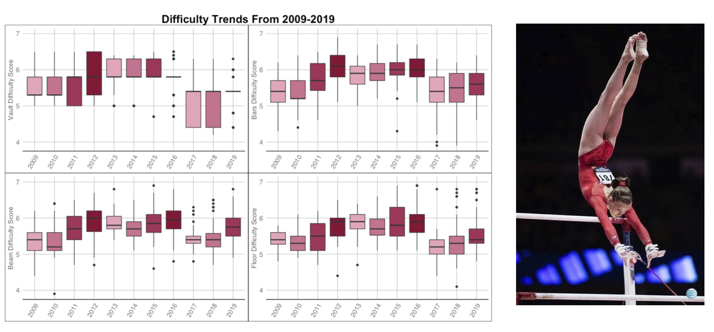
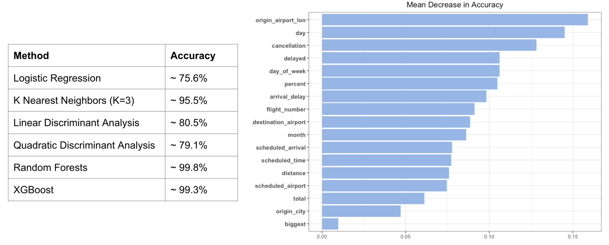

# Portfolio
---
## Projects

### Course Performance Dashboard
 
A project completed with an internal UCLA client for Stats 141SL —— Statistical Consulting:  

**Description:** An interactive R Shiny Dashboard to aid UCLA students in making future course decisions. The user can view suggested class recommendations based on the user’s previous courses taken, grades, major, and major department; they may also see grade distributions in a future course for students who also received the same grade in the same class as the user’s original input. Course descriptions and prerequisites are also listed, if available, and finally, an R-squared value is shown to provide the student an idea of the importance in course 1 grades in explaining and predicting course 2 grades.

---
### Investigation of Land-Atmosphere Interaction During Extreme Heat Events

My work as a student researcher for Professor Karen McKinnon(Statistics & A&ES) on the role of the land surface and atmospheric circulation on the initiation and evolution of heatwave events in North America. 
**Abstract:** Extreme heat events pose massive threats to human health and economies and are on the rise due to climate change. Recent advances suggest that land-atmosphere interactions often amplify the magnitude and persistence of heatwaves, especially in water-limited areas. The amplification is thought to occur due to a positive feedback between soil moisture and temperature: warmer temperatures can dry the land surface, and a drier land surface can lead to warming through a re-partitioning of energy from latent to sensible heating. This study combines the FLUXNET2015 observation and two reanalysis datasets (ERA-5 and MERRA-2) to explore the land surface’s role on the evolution of summertime heat waves in North America. We find that the expected amplification via greater sensible heating does not occur generally across the continent. Rather, several stations in North America experience negative sensible heat flux anomalies both before and during heat waves. We identify four distinct regimes based on whether sensible and latent heat fluxes are anomalously positive or negative before and during heatwaves. For example, while the East Coast of the United States shows a classic increase in sensible heating and decrease in latent heating in the days before heatwaves, regions in Baja California and Northeastern Canada show decreases in both latent and sensible heating surrounding heatwaves. Moreover, in regions where sensible heating is negative (into the land surface) before heatwaves, we identify a clear advective influence in the vertical potential temperature profiles. The results provide a more complete view of the diversity of land-atmosphere interactions associated with heat waves.

---
### Scoring Trends and Score Optimization in Elite Gymnastics

 
[An article](https://www.bruinsportsanalytics.com/post/elite_gymnastics) written for Bruin Sports Analytics, a data science sports journalism club at UCLA, analyzing common beliefs in the in gymnastics community:   

**Description:** In elite gymnastics, a gymnast’s score is broken up into two components: execution and difficulty. Two common notions within the gymnastics community are that difficulty scores and execution scores increase as a quad progresses -- the thinking being that as the Olympics progress, gymnasts do harder, more perfect, gymnastics. Using data from the USA gymnastics official website from three different quads: 2009-2012, 2013-2016, and 2017-present, and focusing on American senior elite female gymnasts perfomance at major competitions, I investigate these beliefs via statistical methods. Through F-tests I determined which events showed a significant change by year, and through Tukey HSD post hoc analysis I found in which years the differences came from. I found that, while difficulty scores do generally increase as olympic quads progress, execution scores do not. Finally, to assess whether the importance of difficulty scores or executions scores differs per event, I grouped the gymnasts in quantiles based on their rankings and analyzed the variation in each direction. It seems that, for bars, beam, and floor, high execution score is favored over a high level of difficulty, whereas for vault, difficulty is favored more than on the other events.
 

---
### Stranger Things Text Mining Analysis

 
[A personal project](https://averyrobinson98.github.io/ST-series-Text-Mining/) analyzing Netflix's Stranger Things via sentiment analysis and ML methods:  

**Description:** To gain insights into Netflix’s Stranger Things, I scraped the episode script data for statistical analysis to understand general word, speech, and sentiment patterns in the series. For my exploratory data analysis, I constructed visualizations of basic speaking frequency patterns, such as total lines, average word length, and vocabulary size, and analyzed season-to-season line proportion changes. To further analyze speech patterns, I calculated frequent word use, as well as the tf-idf ( term-frequency and inverse document frequency) scores to find unique words from each character. Additionally, I analyzed sentiment patterns in characters’ speech using R’s sentiment libraries. Finally, I investigated variation in IMDB ratings for each episode using stepwise selection, regularization, and random forests. 
 

  

---
### Kaggle Competition: Predict Flight Cancellation using Random Forests, Boosting Methods, Discriminant Analysis, etc.

 
An in-class Kaggle competition predicting flight cancellation:  

**Description:** My group and I analyzed components of airline, airport, and population data that can help predict flight cancellation. Our report provides a detailed account of our feature engineering process, exploratory data analysis, and machine learning methods that we used to achieve our goal and predict flight cancellation with an accuracy of 99.85%.
 

 

---

© 2020 Khanh Tran. Powered by Jekyll and the Minimal Theme.

