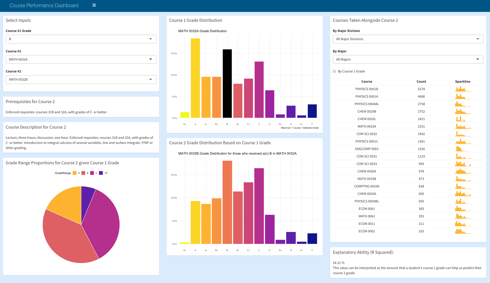

# Portfolio
---
## Projects

### Course Performance Dashboard

A project completed with an internal UCLA client for Stats 141SL -- Statistical Consulting.

**Description:** An interactive R Shiny Dashboard to aid UCLA students in making future course descisions. A student who is wondering how they might do in a future course based on their grade in a previous course may enter the courses along with their course 1 grade in the top left filter box. They will then be presented with a distribution of course 1 grades, with the black bar indicating their placement in the distribution, and a distribution of course 2 grades for everyone who *also* received the same course 1 grade. Additionally, the student will be able to see, on the righthand side of the dashboard, the most frequent courses taken alongside the course entered as course 2. Course descriptions and pre-requistes are also listed, if available, and finally, an R-squared value is shown to provide the student an idea of the importance in course 1 grades in explaining and predicting course 2 grades.

---
### Scoring Trends and Score Optimization in Elite Gymnastics

[An article](https://www.bruinsportsanalytics.com/post/elite_gymnastics) I wrote as a data journalist for Bruin Sports Analytics at UCLA.    
 

 
  In elite gymnastics, a gymnast’s score is broken up into two components: execution and difficulty. Two common notions within the gymnastics community are that difficulty scores and execution scores increase as a quad progresses -- the thinking being that as the Olympics progress, gymnasts do harder, more perfect, gymnastics. Using data from the USA gymnastics official website from three different quads: 2009-2012, 2013-2016, and 2017-present, and focusing on American senior elite female gymnasts perfomance at major competitions, I investigate these beliefs via statistical methods. Through F-tests I determined which events showed a significant change by year, and through Tukey HSD post hoc analysis I found in which years the differences came from. I found that, while difficulty scores do generally increase as olympic quads progress, execution scores do not. Finally, to assess whether the importance of difficulty scores or executions scores differs per event, I grouped the gymnasts in quantiles based on their rankings and analyzed the variation in each direction. It seems that, for bars, beam, and floor, high execution score is favored over a high level of difficulty, whereas for vault, difficulty is favored more than on the other events.

  

---
### Stranger Things Text Mining Analysis

[A personl project](https://averyrobinson98.github.io/ST-series-Text-Mining/)  analyzing Netflix's Stranger Things via sentiment analysis and ML methods.    
 

To gain insights into my favorite show, I scraped the episode script data for statistical analysis to understand general word, speech, and sentiment patternns in the series. For my exploratory data analysis, I constructed visualizations of basic speaking frequency patterns, such as total lines, average word length, and vocabulary size, and analyzed season-to-season line proportion changes. To further analyze speech patterns,
  
  Additionally, I analyze IMBD ratings of each episode and ese a variety of statistical and machine learning techniques to identify variables that help explain the variation observed ratings. 

 

  

---
### Kaggle Competition: Predict Flight Cancellation using Random Forests, Boosting Methods, Discriminant Analysis, etc.

In order to predict whether a message is spam, first I vectorized text messages into a format that machine learning algorithms can understand using Bag-of-Word and TF-IDF. Then I trained a machine learning model to learn to discriminate between normal and spam messages. Finally, with the trained model, I classified unlabel messages into normal or spam.

 

- Logistic Regression: *** ~ 75.6% ***
- KNN (K=3): *** ~ 95.5% ***
- LDA: *** ~ 80.5% ***
- QDA: *** ~ 79.1% ***
- Random Forest: *** ~ 99.8% ***
- XGBoost: **~ 99.3% **
 

---

© 2020 Khanh Tran. Powered by Jekyll and the Minimal Theme.

