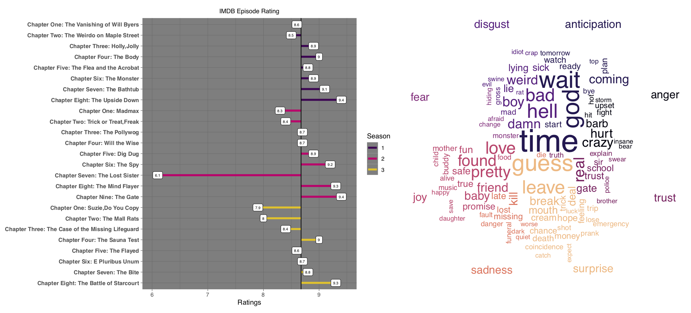

# Portfolio
---
## Projects

### Course Performance Dashboard

A project completed with an internal UCLA client for Stats 141SL -- Statistical Consulting.

**Description:** An interactive R Shiny Dashboard to aid UCLA students in making future course descisions. A student who is wondering how they might do in a future course based on their grade in a previous course may enter the courses along with their course 1 grade in the top left filter box. They will then be presented with a distribution of course 1 grades, with the black bar indicating their placement in the distribution, and a distribution of course 2 grades for everyone who *also* received the same course 1 grade. Additionally, the student will be able to see, on the righthand side of the dashboard, the most frequent courses taken alongside the course entered as course 2. Course descriptions and pre-requistes are also listed, if available, and finally, an R-squared value is shown to provide the student an idea of the importance in course 1 grades in explaining and predicting course 2 grades.

---
### Scoring Trends and Score Optimization in Elite Gymnastics

 Using data from the USA gymnastics official website from three different quads: 2009-2012, 2013-2016, and 2017-present, and focusing on American senior elite female gymnasts perfomance at major competitions, I investigate common notions in the gymnastics community regarding score progression throughout quads. Additionally, I investigate scoring combinations on each event in combination with gymnast ranking to discover which score component is most beneficial to increase on each individual event -- difficulty or exection -- so that a gymnast could optimize her scores. 
  

---
### Stranger Things Text Mining Analysis

[Project Report (GH Pages)](https://averyrobinson98.github.io/ST-series-Text-Mining/)  

To gain insights into my favorite show, I scraped the episode script data for statistical analysis to understand general word, speech, and sentiment patternns in the series. Additionally, I analyze IMBD ratings of each episode and ese a variety of statistical and machine learning techniques to identify variables that help explain the variation observed ratings. 

 

 

---
### Detect Spam Messages: TF-IDF and Naive Bayes Classifier

In order to predict whether a message is spam, first I vectorized text messages into a format that machine learning algorithms can understand using Bag-of-Word and TF-IDF. Then I trained a machine learning model to learn to discriminate between normal and spam messages. Finally, with the trained model, I classified unlabel messages into normal or spam.

 

 

---
## Data Science

### Credit Risk Prediction Web App

After my team preprocessed a dataset of 10K credit applications and built machine learning models to predict credit default risk, I built an interactive user interface with Streamlit and hosted the web app on Heroku server.

 

 

---
### Kaggle Competition: Predict Flight Cancellation using Lasso, Ridge, XGBoost and LightGBM
Put stuff from that one class here

I performed comprehensive EDA to understand important variables, handled missing values, outliers, performed feature engineering, and ensembled machine learning models to predict house prices. My best model had Mean Absolute Error (MAE) of 12293.919, ranking <b>95/15502</b>, approximately <b>top 0.6%</b> in the Kaggle leaderboard.

 

 

---
### Predict Breast Cancer with RF, PCA and SVM using Python

In this project I am going to perform comprehensive EDA on the breast cancer dataset, then transform the data using Principal Components Analysis (PCA) and use Support Vector Machine (SVM) model to predict whether a patient has breast cancer.

 

 

---
### Business Analytics Conference 2018: How is NYC's Government Using Money?

In three-month research and a two-day hackathon, I led a team of four students to discover insights from 6 million records of NYC and Boston government spending data sets and won runner-up prize for the best research poster out of 18 participating colleges.

 

 

---
## Filmed by me

Besides Data Science, I also have a great passion for photography and videography. Below is a list of films I documented to retain beautiful memories of places I traveled to and amazing people I met on the way.

 

- [Ada Von Weiss - You Regret (Winter at Niagara)](https://www.youtube.com/watch?v=-5esqvmPnHI)
- [The Weight We Carry is Love - TORONTO](https://www.youtube.com/watch?v=vfZwdEWgUPE)
- [In America - Boston 2017](https://www.youtube.com/watch?v=YdXufiebgyc)
- [In America - We Call This Place Our Home (Massachusetts)](https://www.youtube.com/watch?v=jzfcM_iO0FU)

---

© 2020 Khanh Tran. Powered by Jekyll and the Minimal Theme.

