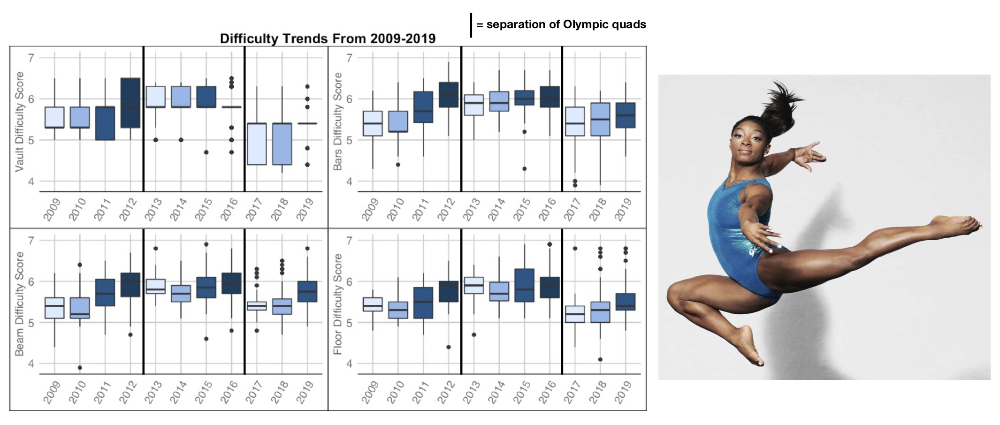

# Portfolio
---
## Projects

### Course Performance Dashboard

  
A project completed with an internal UCLA client for Stats 141SL —— Statistical Consulting. 

<em>**Description:**</em> An interactive R Shiny Dashboard to aid UCLA students in making future course decisions. The user can view suggested class recommendations based on the user’s previous courses taken, grades, major, and major department; they may also see grade distributions in a future course for students who also received the same grade in the same class as the user’s original input. Course descriptions and prerequisites are also listed, if available, and finally, an R-squared value is shown to provide the student an idea of the importance in course 1 grades in explaining and predicting course 2 grades.

---
### Scoring Trends and Score Optimization in Elite Gymnastics

  
[An article](https://www.bruinsportsanalytics.com/post/elite_gymnastics) written for Bruin Sports Analytics, a data science sports journalism club at UCLA, analyzing common beliefs in the in gymnastics community   

 
  In elite gymnastics, a gymnast’s score is broken up into two components: execution and difficulty. Two common notions within the gymnastics community are that difficulty scores and execution scores increase as a quad progresses -- the thinking being that as the Olympics progress, gymnasts do harder, more perfect, gymnastics. Using data from the USA gymnastics official website from three different quads: 2009-2012, 2013-2016, and 2017-present, and focusing on American senior elite female gymnasts perfomance at major competitions, I investigate these beliefs via statistical methods. Through F-tests I determined which events showed a significant change by year, and through Tukey HSD post hoc analysis I found in which years the differences came from. I found that, while difficulty scores do generally increase as olympic quads progress, execution scores do not. Finally, to assess whether the importance of difficulty scores or executions scores differs per event, I grouped the gymnasts in quantiles based on their rankings and analyzed the variation in each direction. It seems that, for bars, beam, and floor, high execution score is favored over a high level of difficulty, whereas for vault, difficulty is favored more than on the other events.

  

---
### Stranger Things Text Mining Analysis

  
[A personl project](https://averyrobinson98.github.io/ST-series-Text-Mining/)  analyzing Netflix's Stranger Things via sentiment analysis and ML methods.  

To gain insights into Netflix’s Stranger Things, I scraped the episode script data for statistical analysis to understand general word, speech, and sentiment patterns in the series. For my exploratory data analysis, I constructed visualizations of basic speaking frequency patterns, such as total lines, average word length, and vocabulary size, and analyzed season-to-season line proportion changes. To further analyze speech patterns, I calculated frequent word use, as well as the tf-idf ( term-frequency and inverse document frequency) scores to find unique words from each character. Additionally, I analyzed sentiment patterns in characters’ speech using R’s sentiment libraries. Finally, I investigated variation in IMDB ratings for each episode using stepwise selection, regularization, and random forests. 

 

  

---
### Kaggle Competition: Predict Flight Cancellation using Random Forests, Boosting Methods, Discriminant Analysis, etc.

For an in-class Kaggle classification competition, my group and I analyzed components of airline, airport, and population data that can help predict flight cancellation. Our report provides a detailed account of our feature engineering process, exploratory data analysis, and machine learning methods that we used to achieve our goal and predict flight cancellation with an accuracy of 99.85%.

 

 

---

© 2020 Khanh Tran. Powered by Jekyll and the Minimal Theme.

